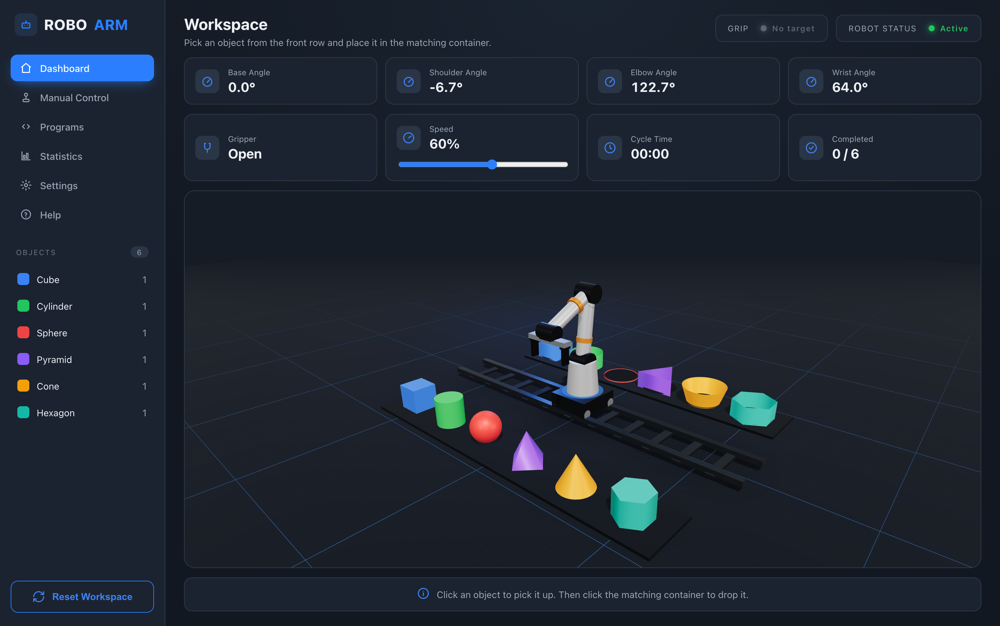

# RoboArm — 3D Pick-and-Place Simulator

A dark control-room dashboard wrapping a real-time 3D robot-arm simulation. Click a
shape and a UR-style cobot, riding a linear rail, precisely picks it with inverse
kinematics and drops it into the matching container — with real Rapier physics for
the grip and the drop, plus a live telemetry dashboard.

Frontend only — no backend, no API. Everything (kinematics, physics, choreography)
runs in the browser.



## Features

- **Procedural robot arm** built from primitives as a real kinematic chain:
  Carriage (rail X) → Base (yaw) → Shoulder → Elbow → Wrist → 2-finger parallel gripper.
- **Linear rail (7th axis)** so the arm can reach every slot, including the corners.
- **Hybrid analytic inverse kinematics** — closed-form 2-link planar solve that keeps
  the gripper pointing straight down at any target.
- **Real gripping physics (Rapier):** objects are dynamic rigid bodies with per-shape
  colliders; kinematic fingers physically touch them; CCD prevents fast drops from
  tunneling out of the bins.
- **Grip-readiness chip** (No target → Align → Ready → Gripping) driven by live
  proximity to the nearest object.
- **Waypoint choreography** with smoothstep easing for hover → descend → grip → lift →
  sweep → place cycles, with adjustable speed.
- **Manual Control page** — drive each joint, the rail, and the gripper directly.
- **Live telemetry** (joint angles, gripper state, cycle time, completed count) updated
  per-frame without re-rendering React.

## Tech Stack

| Area | Tech |
| --- | --- |
| Framework | [React 19](https://react.dev) + [TypeScript](https://www.typescriptlang.org) |
| Build tool | [Vite](https://vite.dev) |
| 3D rendering | [Three.js](https://threejs.org) via [@react-three/fiber](https://github.com/pmndrs/react-three-fiber) |
| 3D helpers | [@react-three/drei](https://github.com/pmndrs/drei) |
| Physics | [Rapier](https://rapier.rs) via [@react-three/rapier](https://github.com/pmndrs/react-three-rapier) |
| State | [Zustand](https://github.com/pmndrs/zustand) |
| Routing | [React Router](https://reactrouter.com) |

## Getting Started

```bash
npm install
npm run dev      # start the dev server (http://localhost:5173)
npm run build    # type-check + production build to dist/
npm run preview  # preview the production build
```

## Deployment

Deployed on [Vercel](https://vercel.com) as a static Vite build (`dist/`). The included
`vercel.json` rewrites all routes to `index.html` so the client-side React Router routes
resolve on direct navigation / refresh.
